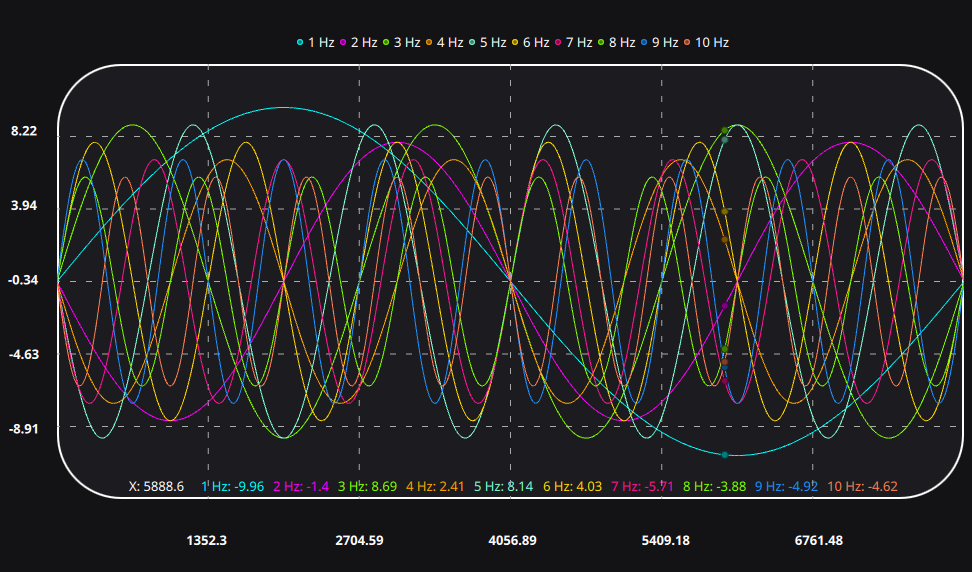
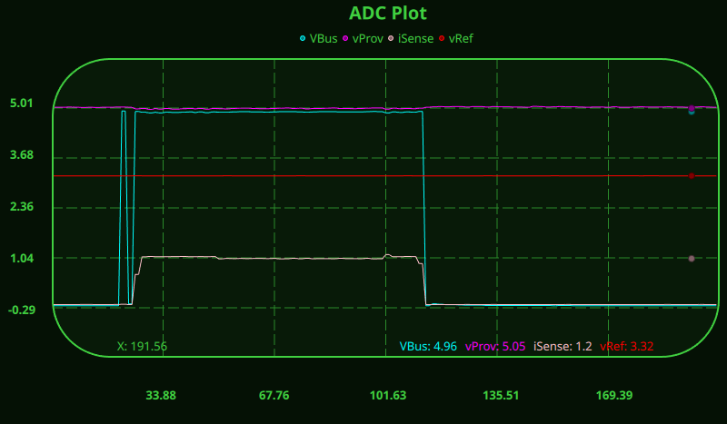

# QMcu

QMcu is a modular Qt-based framework designed for embedded MCU development and live debugging.
It provides real-time access to target variables (via ST-Link or similar probes) directly inside QML, with smooth plotting and visualization tools for quick inspection and analysis.

## ✨ Features

### 🧩 Modular Architecture
Split into independent components:
 - QMcu::Debug — provides direct access to MCU variables, symbol resolution, and memory probing.
 - QMcu::Plot — high-performance Vulkan plotting engine designed for real-time data visualization in QML.

### 🔍 Live Variable Monitoring
Use VariableProxy and VariableProxyGroup to read and update variables from an ELF image over an ST-Link probe — no firmware modification needed.

### 📈 Real-time plotting
Smoothly render MCU signals using PlotView and PlotLineSeries, with customizable colors, axes, and grid layouts.

### ⚙️ QML-native integration
The entire API is exposed to QML, allowing reactive and declarative dashboards for embedded systems.

### 🧠 Designed for STM32 and similar targets
Supports symbol-based memory access and seamless integration with typical STM32 ELF binaries.

## 📦 Example

```qml
import QtQuick
import QtQuick.Controls
import QtQuick.Layouts
import QMcuDebug
import QMcuPlot

ApplicationWindow {
    visible: true
    width: 800; height: 600
    title: "ADC Watch"

    Debugger {
        executable: "/path/to/firmware.elf"
    }

    StLinkProbe {
        // serial: "004900423433510B37363934"
        speed: 24000
    }

    VariableProxyGroup { id: adcProxies }

    Timer {
        interval: 500
        repeat: true
        running: true
        onTriggered: {
            adcProxies.update();
            plot.update();
        }
    }

    PlotView {
        id: plot
        anchors.fill: parent
        title: "ADC Plot"

        axisX: ValueAxis { min: 0; max: 200 }
        axisY: ValueAxis { min: -1.3; max: 6.3 }

        PlotLineSeries {
            name: "VBus"
            lineColor: "cyan"

            ScrollPlotProvider {
                sampleCount: 200
                VariableProxy {
                    name: "adcVariableNameWithinExecutable"
                    group: adcProxies
                }
            }
        }
    }
}
```
This simple QML file connects to a running MCU through ST-Link, reads live ADC values, and plots them in real time — all declaratively.

Run with: `QMcuWatch my-watcher.qml`

## 🧰 Build & Install

### Dependencies

Following libraries are required to be installed on the system:

- liblldb: used for symbol resolution
- libstlink: used for MCU communication
- Qt6:
  - Core
  - Qml
  - Charts

Following libraries are used internally (automatically fetcher during compilation):

- magic_enum: used for enum printing
- glm: matrix operations

### Install

```bash
# configure
cmake --preset release
# build
cmake --build --preset release
# install
sudo cmake --build --preset release --target install
# or
sudo cmake --workflow --preset release-install
```

## 📈 Screenshots





## 📄 License
[MIT License](LICENSE).
